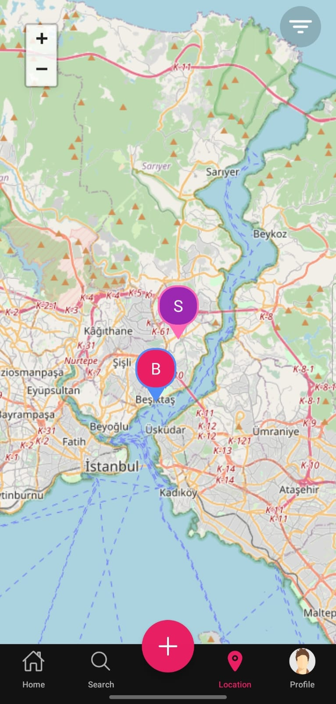

# 📱 Social Media Mobile App

A mobile app that allows users to discover nearby locations, share photos and videos, and interact with others in real time.

---

## 🚀 Features

- 📍 **Location-Based:** See users and places around you on a map.
- 🖼️ **Image & Video Sharing:** Share photos, reels, and stories instantly.
- 🗺️ **Map Integration:** View your location and others with pins.
- 💬 **Messaging:** Real-time DM and group chat.
- 🔔 **Notifications:** Get alerts for new activities and updates.
- 👤 **Profile & Explore:** Discover new users, follow, and interact.

---

## 📸 Screenshots

| Home Screen                     | Map View                      | Explore Screen               |
| ------------------------------- | ----------------------------- | ---------------------------- |
|  |  |  |
| **Feed, stories, reels**        | **Nearby users on map**       | **Discover new users**       |

| DM List                 | DM Messages                      | Comments                      |
| ----------------------- | -------------------------------- | ----------------------------- |
|  |  |  |
| **Direct messages**     | **Chat details**                 | **Post comments**             |

| Story                      | Profile                      | Settings                      |
| -------------------------- | ---------------------------- | ----------------------------- |
|  |  |  |
| **View stories**           | **User profile**             | **App settings**              |

> 📌 Each screen demonstrates a core feature of the app. All screenshots are in the `/screenshots` folder.

---

## 📂 Project Structure (Summary)

```
/backend
  /controllers      # API route controllers
  /middleware       # Express middlewares
  /models           # Mongoose models
  /routes           # Express route definitions
  /utils            # Utility functions
  server.js         # Main Express app entry

/frontend
  /src
    /components     # Reusable React Native components
    /context        # Context providers
    /screens        # Main app screens
    /services       # API and socket services
    /utils          # Utility functions
  App.tsx           # Main app entry
  package.json      # Frontend dependencies

/screenshots        # App screenshots for documentation
```

---

> For setup, API, and contribution details, see previous sections or ask for a full technical README.
